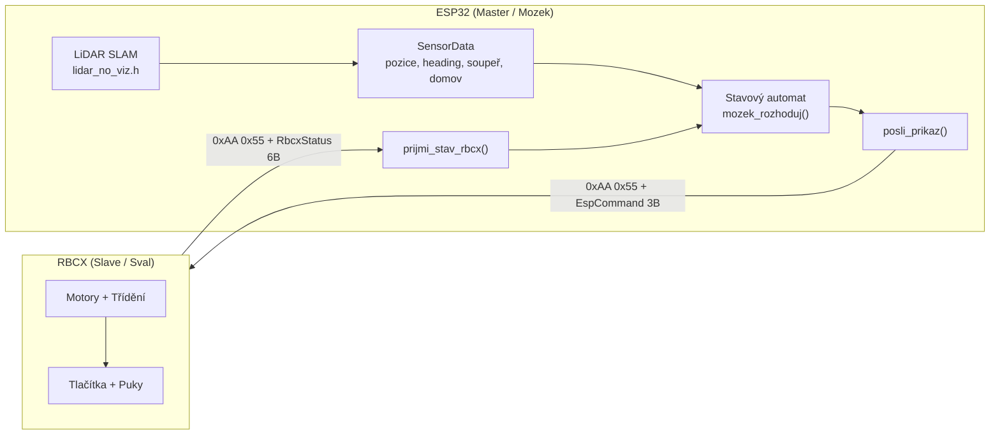
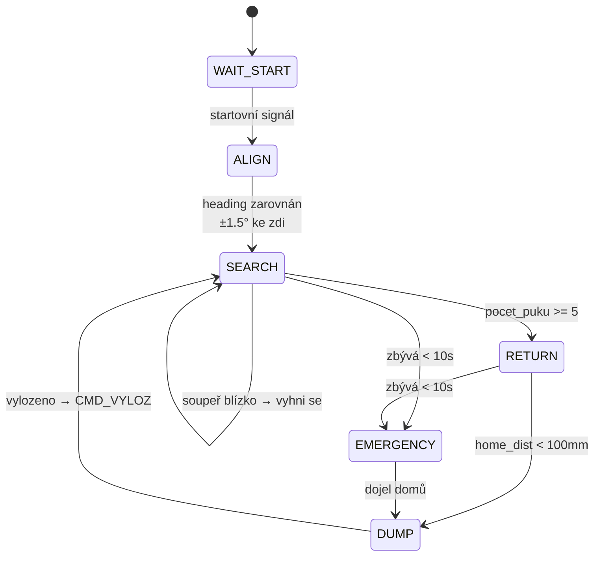

# mozek.h — Podrobné shrnutí

> [!IMPORTANT]
> `mozek.h` je **mozek robota** běžící na ESP32. Sbírá data ze senzorů (LiDAR SLAM) i z RBCX (UART), a na jejich základě rozhoduje co robot dělá. RBCX je jen "sval" — vykonává příkazy.

---

## 1. Architektura — kdo co dělá



---

## 2. Data co mozek vidí

### 2.1 `SensorData senzory` — z LiDARu (aktualizováno každý frame)

| Proměnná | Typ | Popis | Příklad |
|---|---|---|---|
| `senzory.pos_x` | float | Pozice X v mm (0..1500) | `742.0` |
| `senzory.pos_y` | float | Pozice Y v mm (0..1500) | `318.5` |
| `senzory.heading` | float | Heading ve stupních (-180..180) | `-12.0` |
| `senzory.home_dist` | float | Vzdálenost k domovu v mm | `215.0` |
| `senzory.home_angle` | float | Úhel k domovu (absolutní) | `35.0` |
| `senzory.home_dir` | char | Směr otočení k domovu | `'R'` = doprava |
| `senzory.opp_valid` | bool | Vidíme soupeře? | `true` |
| `senzory.opp_x/y` | float | Globální pozice soupeře mm | `800.0, 600.0` |
| `senzory.opp_dist` | float | Vzdálenost k soupeři mm | `400.0` |
| `senzory.opp_angle` | float | Úhel k soupeři (absolutní) | `120.0` |
| `senzory.opp_dir` | char | Směr k soupeři | `'L'` = doleva |

**Odkud se plní:** Funkce `mozek_aktualizuj_senzory()` čte přímo z `nv_g_rx`, `nv_g_ry`, `nv_g_h`, `nv_opp_*` (proměnné z `lidar_no_viz.h`) a přepočítává na přehledné hodnoty.

### 2.2 `RbcxData rbcx` — z RBCX přes UART (každých ~200ms)

| Proměnná | Typ | Popis | Příklad |
|---|---|---|---|
| `rbcx.connected` | bool | Máme vůbec spojení? | `true` |
| `rbcx.status` | uint8_t | Co RBCX právě dělá | `STAT_BUSY (0x81)` |
| `rbcx.btn_up` | bool | Přední tlačítko UP (náraz vpředu) | `false` |
| `rbcx.btn_down` | bool | Přední tlačítko DOWN (náraz vpředu) | `false` |
| `rbcx.btn_left` | bool | Boční LEFT | `false` |
| `rbcx.btn_right` | bool | Boční RIGHT | `false` |
| `rbcx.pocet_puku` | int | Kolik puků naší barvy RBCX nasbíral | `3` |
| `rbcx.last_rx` | ulong | Kdy přišel poslední paket (millis) | `12450` |

**Odkud se plní:** Funkce `prijmi_stav_rbcx()` — stavový automat skenující `0xAA 0x55` v Serial1.

### 2.3 Pomocné funkce

| Funkce | Co vrací |
|---|---|
| `rbcx_hotovo()` | `true` pokud `status == STAT_DONE` nebo `STAT_READY` — RBCX je prepared na nový příkaz |

---

## 3. Příkazy co mozek posílá na RBCX

```cpp
posli_prikaz(CMD, param);  // odešle [0xAA][0x55][cmd][param_lo][param_hi]
```

| Příkaz | Hex | Param | Co RBCX udělá |
|---|---|---|---|
| `CMD_NOP` | 0x00 | — | Nic (jen vrátí stav) |
| `CMD_STOP` | 0x01 | — | Zastaví všechno |
| `CMD_JED_SBIREJ` | 0x02 | rychlost % | Jede dopředu + třídí puky (nekonečně, dokud nepřijde STOP) |
| `CMD_OTOC_VLEVO` | 0x03 | úhel ° | Otočí se doleva o N stupňů, pak DONE |
| `CMD_OTOC_VPRAVO` | 0x04 | úhel ° | Otočí se doprava o N stupňů, pak DONE |
| `CMD_COUVEJ` | 0x05 | vzdálenost mm | Couvne o N mm, pak DONE |
| `CMD_VYLOZ` | 0x06 | — | Otevře serva, vysype puky, pak DONE |

> [!NOTE]
> Když RBCX dostane jakýkoliv příkaz (kromě NOP), **nejdřív zastaví** co běží (`zastav_jizdu = true`), pak vykoná nový. Po dokončení pošle `STAT_DONE`.

---

## 4. Stavový automat — rozhodovací logika



### 4.1 `STATE_WAIT_START` — Čekání na start
- **Co dělá:** Nic, čeká na signál (tlačítko / UART příkaz)
- **Přechod:** Až přijde signál → `cas_startu = millis()` → `STATE_ALIGN`
- **Stav teď:** TODO

### 4.2 `STATE_ALIGN` — Zarovnání podél zdi
- **Co dělá:** Pomalá jízda (`CMD_JED_SBIREJ(20)`), sleduje `senzory.heading`
- **Cíl:** Heading ±1.5° od nejbližšího násobku 90° (0°/90°/180°/270°)
- **Přechod:** Zarovnáno → `CMD_STOP` → `STATE_SEARCH`
- **Stav teď:** TODO

### 4.3 `STATE_SEARCH` — Lajnová strategie (hlavní sbírání)
- **Co dělá:** Jede rovně (`CMD_JED_SBIREJ(60)`), sleduje SLAM pozici
- **Lajnový vzor** (z `.excalidraw.png`):
  1. Jeď rovně ~1200mm (šířka arény minus okraj)
  2. `CMD_STOP` → `CMD_OTOC_VPRAVO(90)` → čekat `STAT_DONE`
  3. `CMD_JED_SBIREJ(60)` → ujeď 150mm (šířka jedné lajny ≈ šířka robota)
  4. `CMD_STOP` → `CMD_OTOC_VPRAVO(90)` → čekat `STAT_DONE`
  5. Nová lajna opačným směrem → opakuj
- **Přerušení za jízdy:**
  - `senzory.opp_valid && senzory.opp_dist < 300` → `CMD_STOP` + vyhýbací manévr
  - `rbcx.btn_up || rbcx.btn_down` → `CMD_COUVEJ(100)` + `CMD_OTOC(90)`
  - `rbcx.pocet_puku >= 5` → `STATE_RETURN`
- **Stav teď:** TODO

### 4.4 `STATE_RETURN` — Navigace domů
- **Co dělá:**
  1. Přečte `senzory.home_angle` a `senzory.home_dir`
  2. Otočí se směrem k domovu: `CMD_OTOC_VLEVO/VPRAVO(home_angle)`
  3. Jede rychle: `CMD_JED_SBIREJ(80)`
  4. Sleduje `senzory.home_dist` — až < 100mm → `CMD_STOP`
- **Přechod:** Dojel → `STATE_DUMP`
- **Stav teď:** TODO

### 4.5 `STATE_DUMP` — Vyložení puků
- **Co dělá:** `posli_prikaz(CMD_VYLOZ)`
- **Čeká:** `rbcx_hotovo()` == true (RBCX otevře serva, vysype, zavře)
- **Přechod:** Hotovo → `STATE_SEARCH` (další kolo)
- **Stav teď:** TODO

### 4.6 `STATE_EMERGENCY` — Čas končí!
- **Spouštěč:** `zbyva_ms < 10000` (zbývá méně než 10 sekund)
- **Co dělá:** Okamžitě naviguje domů (stejně jako RETURN, ale agresivnější)
- **Přechod:** Dojel → `STATE_DUMP`
- **Stav teď:** TODO

---

## 5. Hlavní smyčka — co se děje v loop()

```
main.cpp loop()
   │
   ├── loop_lidar_nv()          ← čte LiDAR pakety, RANSAC, SLAM
   │     └── aktualizuje: nv_g_rx, nv_g_ry, nv_g_h, nv_opp_*
   │     └── vypisuje: POS 452 318 | HEAD -12° | HOME 215mm 35°R
   │
   └── mozek_update()           ← rozhodovací logika
         ├── mozek_aktualizuj_senzory()   ← kopíruje nv_* → senzory.*
         └── mozek_rozhoduj()
               ├── prijmi_stav_rbcx()     ← čte Serial1 (UART z RBCX)
               ├── kontrola času          ← emergency pokud < 10s
               ├── switch (stav) { ... }  ← stavový automat
               └── debug výpis 1×/s       ← [MOZEK] SEARCH | t=45s | ...
```

---

## 6. Co zbývá implementovat

| Priorita | Stav | Co je potřeba |
|---|---|---|
| 🔴 1 | `WAIT_START` | Startovní mechanismus (tlačítko? RBCX LEFT?) |
| 🟡 2 | `SEARCH` | Lajnová logika — sledování pozice, otáčení na konci |
| 🟡 3 | `RETURN` | Navigace domů z `senzory.home_*` |
| 🟢 4 | `DUMP` | Jednoduchý — jen `posli_prikaz(CMD_VYLOZ)` + čekat |
| 🟢 5 | `ALIGN` | Zarovnání — možná přeskočit a jít rovnou do SEARCH |
| 🟢 6 | `EMERGENCY` | Kopie RETURN s vyšší prioritou |
